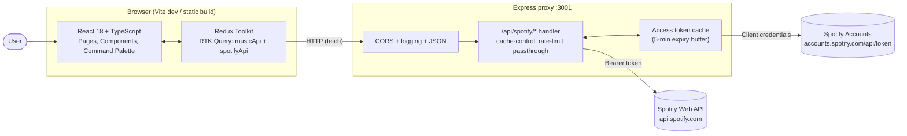
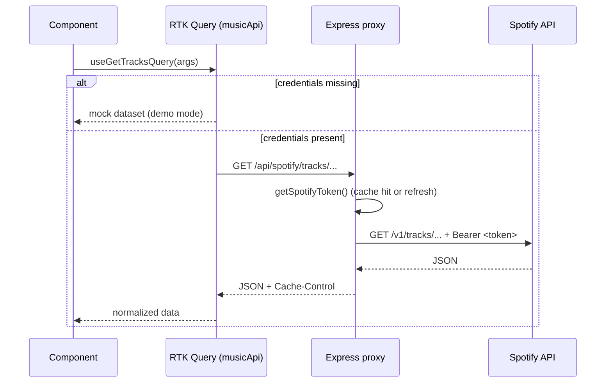

<div align="center">
  <br/>
  
  <h1>NextSound</h1>
  <p>
    A production-grade music discovery app built with React, TypeScript, and a CORS-safe Express proxy to the Spotify Web API.
  </p>

  <p>
    <a href="https://github.com/louisgee8/nextsound/actions/workflows/ci.yml">
      
    </a>
    <a href="https://nextsound-louisgee8.fly.dev">
      
    </a>
    
    
    
    
    
    
    
  </p>
</div>

---

## Table of contents

- [Overview](#overview)
- [Features](#features)
- [Architecture](#architecture)
- [Tech stack](#tech-stack)
- [Project structure](#project-structure)
- [Getting started](#getting-started)
- [Environment variables](#environment-variables)
- [Available scripts](#available-scripts)
- [Testing](#testing)
- [How data flows (request lifecycle)](#how-data-flows-request-lifecycle)
- [Runtime modes](#runtime-modes)
- [Troubleshooting](#troubleshooting)
- [Roadmap](#roadmap)
- [Credits](#credits)

---

## Overview

NextSound is a single-page React application for browsing, searching, and previewing music from the Spotify catalog. It ships with two runtime modes so it works for anyone who clones the repo:

- **Demo mode** runs against curated mock data with real Spotify CDN artwork. No accounts, no keys.
- **Live mode** runs against the Spotify Web API through a small Node/Express proxy that hides the client secret, caches access tokens, and applies sensible cache headers per endpoint.

The app is built with React 18, strict TypeScript, Vite, Tailwind, and Redux Toolkit's RTK Query. Testing is wired up with Vitest, React Testing Library, and Mock Service Worker.

## Features

- **Music discovery** — Hero carousel and curated sections (e.g. Latest Hits) with track grids and album cards
- **Command palette** — `⌘K` / `Ctrl+K` to search tracks, albums, artists, toggle theme, or jump to recent searches
- **Live Spotify or demo** — Same UI works with a real Spotify app (client credentials flow) or with bundled mock data
- **Backend proxy with token caching** — Express layer refreshes tokens with a 5-minute expiry buffer so the frontend never handles secrets
- **Per-endpoint HTTP caching** — Cache-Control headers tuned by endpoint type (search: 5m, featured: 30m, entity lookups: 24h)
- **Typed data layer** — RTK Query with a unified `musicApi` that switches between Spotify and mock sources at runtime
- **Dark / light theme** — Persisted to `localStorage`, toggleable from sidebar or command palette
- **Responsive layout** — Sidebar collapses to a mobile drawer; grids adapt to viewport
- **Resilience** — Error boundary, loading skeletons, lazy-loaded routes, retry-aware API layer
- **Tested** — Vitest + RTL + MSW with utility, service, store, and component test suites

## Architecture



At a glance:

1. The React app dispatches RTK Query hooks from components.
2. `musicApi` decides at request time whether to use Spotify or the mock dataset.
3. Live requests hit the Express proxy, which attaches a cached bearer token and forwards to Spotify.
4. Spotify responses come back with proxy-set `Cache-Control` headers so the browser and any CDN in front of it can cache appropriately.

## Tech stack

| Layer        | Tech                                                                       |
| ------------ | -------------------------------------------------------------------------- |
| UI           | React 18, React Router v6, Tailwind CSS 3, Radix UI, Framer Motion, Swiper |
| Language     | TypeScript 4.9 (strict)                                                    |
| Build        | Vite 7                                                                     |
| State / data | Redux Toolkit 1.9, RTK Query                                               |
| Backend      | Node.js + Express 5 (CORS proxy and token handler)                         |
| Testing      | Vitest 4, React Testing Library, MSW 2, jsdom                              |
| Tooling      | ESLint 9 (flat config), dotenv, concurrently, nodemon                      |

## Project structure

```
nextsound/
├── server/
│   └── index.js              # Express Spotify proxy (CORS, token cache, rate-limit passthrough)
├── src/
│   ├── App.tsx               # Router, theme provider, layout shell
│   ├── main.tsx              # Entry: Redux Provider + App mount
│   ├── pages/                # Home, NotFound (code-split routes)
│   ├── components/ui/        # Radix-based primitives (buttons, dialogs, etc.)
│   ├── common/               # Shared layout pieces (Sidebar, Header, Footer, Error Boundary)
│   ├── services/             # SpotifyAPI.ts, MusicAPI.ts, MCPAudioService.ts
│   ├── store/                # Redux Toolkit store
│   ├── hooks/                # Custom React hooks
│   ├── context/              # Theme and UI context providers
│   ├── utils/                # helper.ts, searchAlgorithm.ts, cn, error helpers
│   ├── constants/            # Genre aliases, route configs
│   ├── data/                 # Curated demo-mode dataset
│   └── mocks/                # MSW handlers (used when VITE_USE_MSW=true)
├── tests/
│   ├── setup.ts              # MSW server, jsdom globals, DOM polyfills
│   ├── utils/                # helper.test.ts, searchAlgorithm.test.ts
│   ├── services/             # SpotifyAPI.test.ts, store.test.ts
│   └── components/           # TrackCard.test.tsx
├── resources/                # Architecture notes, improvement plan
├── docs/                     # Additional documentation
├── vite.config.ts
├── vitest.config.ts
└── tsconfig.json
```

## Getting started

**Prerequisites:** Node.js 18+ and npm.

```bash
git clone <your-repo-url>
cd nextsound
npm install
npm run dev
```

Open http://localhost:5173. The app boots in demo mode immediately, no credentials required.

### Running the full stack (live Spotify)

1. Create an app at the [Spotify Developer Dashboard](https://developer.spotify.com/) and grab the **Client ID** and **Client Secret**.
2. Copy the example env file:

   ```bash
   cp .env.example .env
   ```

3. Fill in your credentials (see [Environment variables](#environment-variables)).
4. Start frontend and proxy together:

   ```bash
   npm run dev:full
   ```

   The frontend runs on `:5173`, the proxy on `:3001`, and you'll see colored logs from both.

## Environment variables

| Variable                     | Required  | Used by         | Description                                                               |
| ---------------------------- | --------- | --------------- | ------------------------------------------------------------------------- |
| `VITE_SPOTIFY_CLIENT_ID`     | Live mode | server + client | Spotify app client ID                                                     |
| `VITE_SPOTIFY_CLIENT_SECRET` | Live mode | server          | Spotify app client secret. Never expose this to the browser               |
| `VITE_USE_MSW`               | No        | client          | Set to `true` to intercept fetches with MSW handlers during dev           |
| `FRONTEND_URL`               | No        | server          | Additional origin to allow via CORS (defaults to `http://localhost:5173`) |
| `PORT`                       | No        | server          | Proxy port (defaults to `3001`)                                           |

> In demo mode, none of the above are required. The app detects missing credentials and falls back to the mock dataset.

## Available scripts

| Script                  | What it does                                            |
| ----------------------- | ------------------------------------------------------- |
| `npm run dev`           | Start the Vite dev server only (demo mode friendly)     |
| `npm run dev:full`      | Start Express proxy and Vite together with colored logs |
| `npm run server:dev`    | Start the Express proxy under `nodemon`                 |
| `npm run server`        | Start the Express proxy once (no watch)                 |
| `npm run build`         | Type-check with `tsc`, then build the client with Vite  |
| `npm run preview`       | Preview the production build locally                    |
| `npm run start`         | Run the built frontend alongside the server             |
| `npm run test`          | Run the Vitest suite once (CI mode)                     |
| `npm run test:watch`    | Run Vitest in watch mode                                |
| `npm run test:ui`       | Open the Vitest browser UI                              |
| `npm run test:coverage` | Run Vitest with V8 coverage reporting                   |

## Testing

NextSound ships with a full test pipeline: Vitest (runner), React Testing Library (component assertions), jsdom (DOM), and MSW (HTTP mocking).

```bash
npm run test            # one-shot
npm run test:watch      # local dev
npm run test:coverage   # coverage report in coverage/
```

Current state:

- **51 tests passing** across 5 suites
- ~12% line coverage as of the initial testing pass (threshold is enforced at 10% to protect against regressions while coverage ramps up)
- Suites live in `tests/` mirroring `src/`

Coverage thresholds live in `vitest.config.ts` and will ratchet up as more components and services get covered in later phases.

## How data flows (request lifecycle)



## Runtime modes

**Demo mode** — No keys. Curated tracks from 2024-2025 with real Spotify artwork served off Spotify's CDN. Every feature works except live search and new releases.

**Live mode** — Adds real search, new releases, and full catalog browsing. Requires the Express proxy to be running because Spotify's Web API rejects direct browser calls on CORS grounds.

The app picks a mode at startup based on whether the client sees credentials and whether the proxy responds.

## Troubleshooting

**CORS errors against Spotify**
Run the proxy (`npm run dev:full` or `npm run server:dev`). Spotify's Web API does not accept CORS preflight from browsers.

**"No music data available" in live mode**
Check that `.env` contains valid `VITE_SPOTIFY_CLIENT_ID` and `VITE_SPOTIFY_CLIENT_SECRET`, and that the proxy is reachable on `:3001`. Hitting `http://localhost:3001/health` should return `status: ok`.

**Port conflicts**
Frontend expects `:5173`, backend expects `:3001`. Override the backend with `PORT=4001 npm run server`. For the frontend, pass `--port` to Vite or add it to `vite.config.ts`.

**TypeScript errors on build**
`npm run build` runs `tsc` before Vite. Errors there are real type errors, not Vite issues. `npm install` first if you haven't synced dependencies.

## Roadmap

This project is being upgraded to production-grade deployed status. Tracked in detail in `resources/IMPROVEMENT_PLAN.md` and the companion Notion tracker.

- [x] **Phase 1 — Foundation** — strict TypeScript, Vitest + RTL + MSW (51 tests), README, ESLint flat config
- [x] **Phase 2 — App features + DevOps layer** — audio player with cross-route persistence, queue (add / clear / play-next), multi-stage Dockerfiles, docker-compose, nginx reverse proxy, secrets discipline
- [ ] **Phase 3 — Production hardening + cloud deploy** — nginx security headers (CSP, HSTS, X-Frame-Options), `/api/*` rate limiting, service worker auto-activation, GitHub Actions CI/CD, public deploy on Fly.io
- [ ] **Phase 4 — Feature polish** — queue persistence to `localStorage`, drag-to-reorder, a11y audit, performance budget, custom domain

## Credits

Originally scaffolded as part of a NextWork learning project. Upgrades and the DevOps / deployment path are part of an ongoing portfolio build-out.

Built with attention for music lovers.
